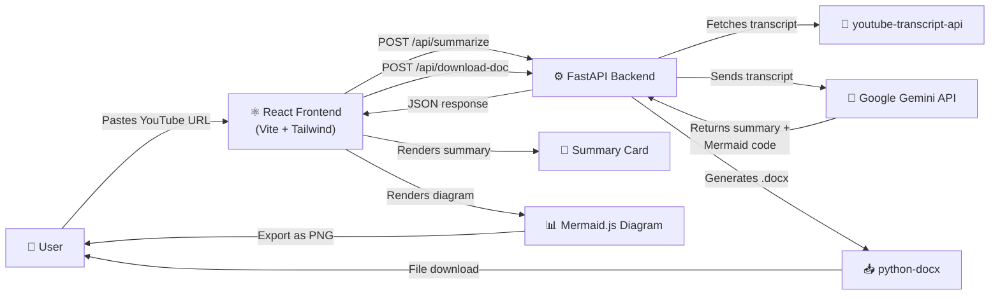

# YouTube Video Summariser — Full Project Structure

## Visual Tree

```
youtube-summariser/
│
├── backend/                        # ⚙️ Python FastAPI Server
│   ├── .env                        # 🔑 Your Gemini API key (NEVER committed to Git)
│   ├── .gitignore                  # Ignores .env, __pycache__, venv, etc.
│   ├── requirements.txt            # All Python dependencies
│   ├── main.py                     # FastAPI app entry point & route definitions
│   └── services.py                 # Core business logic (transcript, Gemini, docx)
│
├── frontend/                       # 🎨 React (Vite) Application
│   ├── public/
│   │   └── favicon.svg             # Site icon
│   ├── src/
│   │   ├── assets/                 # Static images, logos
│   │   ├── components/             # Reusable UI components
│   │   │   ├── Header.jsx          # Top navigation bar
│   │   │   ├── HeroInput.jsx       # URL input + "Summarize" button
│   │   │   ├── SummaryCard.jsx     # Displays the text summary
│   │   │   ├── MermaidDiagram.jsx  # Renders Mermaid.js block diagram
│   │   │   ├── DownloadButtons.jsx # "Download .docx" & "Download .png" buttons
│   │   │   └── LoadingSpinner.jsx  # Animated loader during API calls
│   │   ├── App.jsx                 # Main application shell
│   │   ├── App.css                 # Global application styles
│   │   ├── index.css               # CSS reset & design tokens
│   │   └── main.jsx                # Vite entry point
│   ├── index.html                  # Root HTML template
│   ├── package.json                # Node dependencies
│   └── vite.config.js              # Vite configuration (proxy to backend)
│
└── README.md                       # Project documentation
```

---

## Architecture Flow Diagram



---

## How Each File Fits Together

### Backend Files

| File | Purpose |
|---|---|
| **`main.py`** | Defines 3 API endpoints: `GET /` (health check), `POST /api/summarize` (returns summary + mermaid code), `POST /api/download-doc` (returns a `.docx` file) |
| **`services.py`** | Contains all the heavy-lifting logic: `get_video_transcript()`, `generate_summary()`, `generate_mermaid_code()`, `create_word_document()` |
| **`.env`** | Stores `GEMINI_API_KEY=your_key_here` securely |
| **`requirements.txt`** | Lists: `fastapi`, `uvicorn`, `python-dotenv`, `youtube-transcript-api`, `google-genai`, `python-docx` |

### Frontend Files

| File | Purpose |
|---|---|
| **`App.jsx`** | The main page. Manages state (URL input, summary text, mermaid code, loading state). Orchestrates all child components. |
| **`HeroInput.jsx`** | A centered, beautiful input field + submit button. Calls the `/api/summarize` endpoint. |
| **`SummaryCard.jsx`** | Displays the summary text in a styled card with smooth fade-in animation. |
| **`MermaidDiagram.jsx`** | Takes raw Mermaid syntax from the API response and renders it as an interactive SVG diagram. |
| **`DownloadButtons.jsx`** | Two buttons: "Download Word Doc" (calls `/api/download-doc`) and "Download Diagram" (converts the Mermaid SVG to a PNG using `html2canvas` or direct SVG export). |
| **`LoadingSpinner.jsx`** | A pulsing/skeleton animation shown while the Gemini API processes the transcript. |

---

## API Endpoints

| Method | Endpoint | Request Body | Response |
|---|---|---|---|
| `GET` | `/` | — | `{ "message": "Welcome..." }` |
| `POST` | `/api/summarize` | `{ "video_url": "...", "token_limit": 500 }` | `{ "title": "...", "summary": "...", "mermaid_code": "..." }` |
| `POST` | `/api/download-doc` | `{ "title": "...", "summary": "..." }` | Binary `.docx` file download |

---

## Deployment (100% Free)

| Component | Host | Free Tier |
|---|---|---|
| React Frontend | **Vercel** | Unlimited for hobby projects |
| FastAPI Backend | **Render** | 750 hours/month free |
| AI (Gemini) | **Google AI Studio** | Free tier with generous rate limits |
| Domain (optional) | **Vercel** | Provides `*.vercel.app` subdomain |
